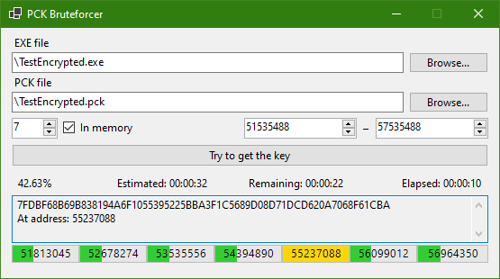

# PCK Bruteforcer

The most straightforward program for finding the encryption key.

This application scans every byte of the executable file and tries to open the `PCK` file until it finds a suitable byte sequence - the Encryption Key.

Currently, only `Godot 4` is supported.

On my processor from 2012, full processing a 56MB exe file takes about 4 minutes. But if you're lucky, the key may be located where the search will take a few seconds.

A more correct(?) solution is to look in memory/disassembler for the address where the encryption key is used to open the PCK, but I wanted to use this method because it does not depend on the versions of the engine and platform. And thanks to this program, I finally switched to `dotnet`, which accelerated the work of the application. And I also found stupid errors in `GodotPCKExplorer`, fixing which I managed to reduce the estimated time from `1:30:00` to `4:00`.

In the future, it is possible to combine this solution and a more specific address search in the disassembler.

https://github.com/DmitriySalnikov/GodotPCKExplorer/assets/7782218/d36c51cb-dc3c-462c-9e7b-2457daa559c2

## Download

This application can be downloaded from [itch.io](https://dmitriysalnikov.itch.io/godot-pck-explorer) or compiled from source code yourself.
