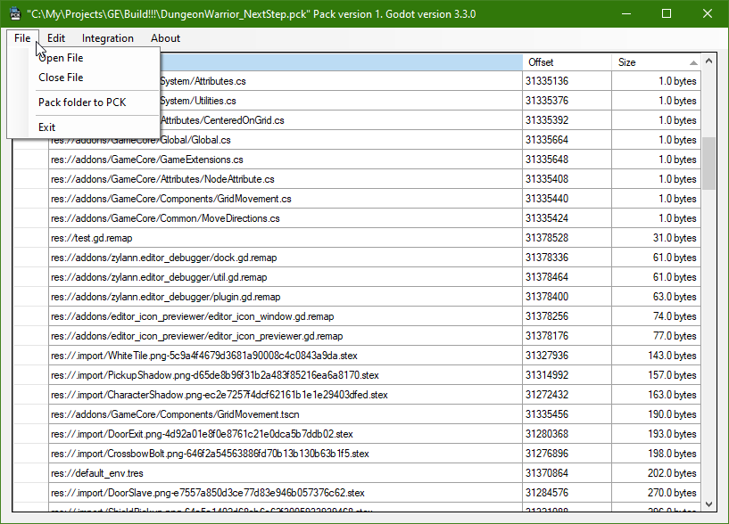

# GodotPCKExplorer

This is an implementation of the Godot Engine's PCK file format in C# with the ability to export files from it and create new packages.

## Features

* Explore existing PCK files
* Export content from PCK files
* Create PCK files
* Integration with system

## Support

## Download

Binaries for the latest version are available on the [Github Releases page](https://github.com/DmitriySalnikov/GodotPCKExplorer/releases/latest).

## License

MIT license
