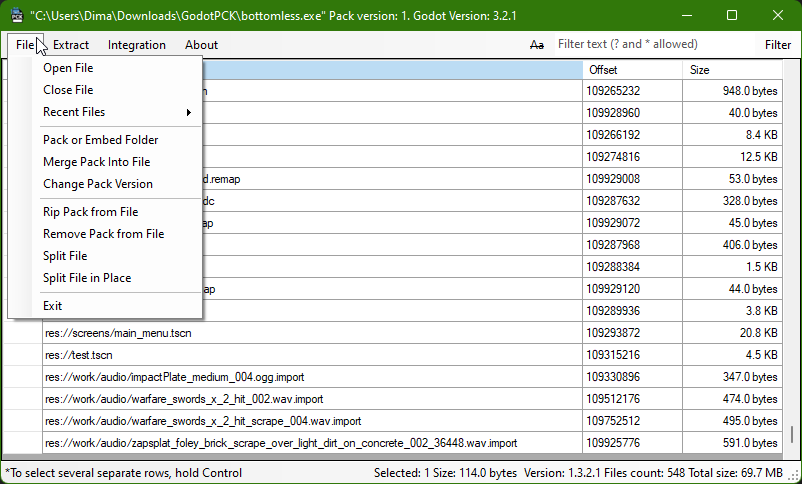
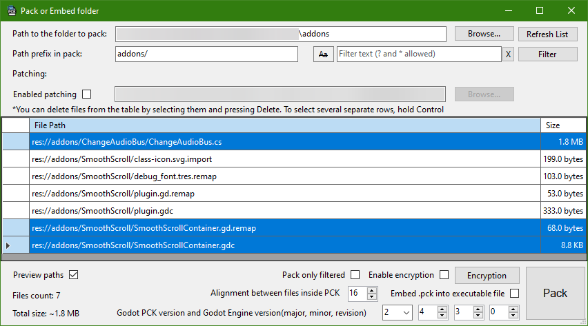
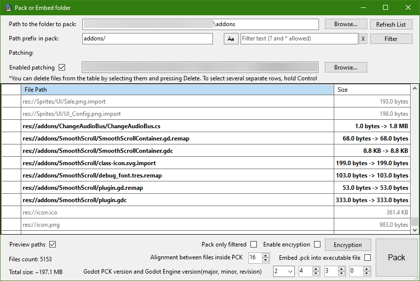
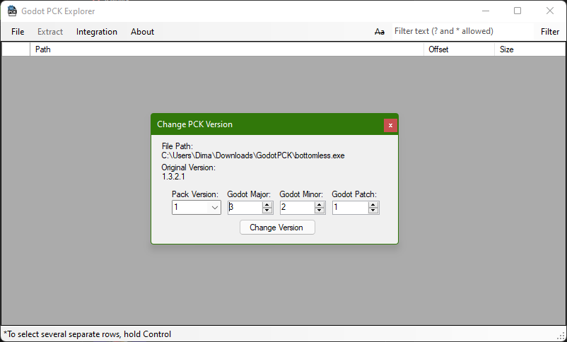

# Godot PCK Explorer

It is a viewer and editor for Godot Engine's PCK files with the ability to extract content and create new packages. Supports Godot 3 and 4.

[Download](#download)

Also `PCK Bruteforcer` is available as part of this project [here](Bruteforcer/).

## Features

* `Explore` existing PCK files (regular PCK or Embedded)
* `Extract` content from a PCK file
* `Create` new PCK files or embed the folder as PCK into any other files
* `Patch` PCK files and replace some of their contents with new files from the folder
* `Merge` existing PCK into other files
* `Change` the version of existing PCK
* `Extract` whole embedded PCK
* `Remove` embedded PCK
* `Split` files with embedded PCK into two separate files
* Supports encrypted Godot 4 PCK
* And also all these features are available via the `console`. Just write `GodotPCKExplorer.Console.exe -h` to get help.
* This program is available in two versions:
  * `UI`: Supports only `Windows` and requires the installation of the `.NET Desktop Runtime`
  * `Console`: Supports `Windows`, `Linux` and `macOS`

PCK Explorer also supports paths with prefix `user://`. When extracting, files with the prefix `user://` will be placed in the folder `@@user@@`. Also, when packing, files from `@@user@@` will have the prefix `user://`.

In Godot 4.4, support for removing files in PCK patches was added, and this program also supports this feature. Files with the `Removal` flag will have `.@@removal@@` in the name when extracted. Also, the `.@@removal@@` from the name will be removed and converted to the `Removal` flag when packing.

## Support

<b>USDT-TRC20 TEw934PrsffHsAn5M63SoHYRuZo984EF6v</b>

## Download

The binaries of the latest version are available on [**itch.io**](https://dmitriysalnikov.itch.io/godot-pck-explorer) or on the [**Github Releases page**](https://github.com/DmitriySalnikov/GodotPCKExplorer/releases/latest).

> [!IMPORTANT]
> Starting from version 1.4.2, `native` and `dotnet` versions of the program have become available for download.
>
> `native` is a standalone program that does not require anything extra to run.
>
> `dotnet` is a program that requires `.NET 8` to work. Its download should be prompted when you run `.exe` files in Windows, if it has not been installed previously.
>
> The `.NET Desktop Runtime` is required to use the UI versions of the program.
>
> On Linux and macOS, you just need to install the `.NET Runtime`. Use the command `dotnet GodotPCKExplorer.Console.dll [some arguments]` to run it.
>
> `.NET 8` is available [here](https://dotnet.microsoft.com/en-us/download/dotnet/8.0).

## License

MIT license
